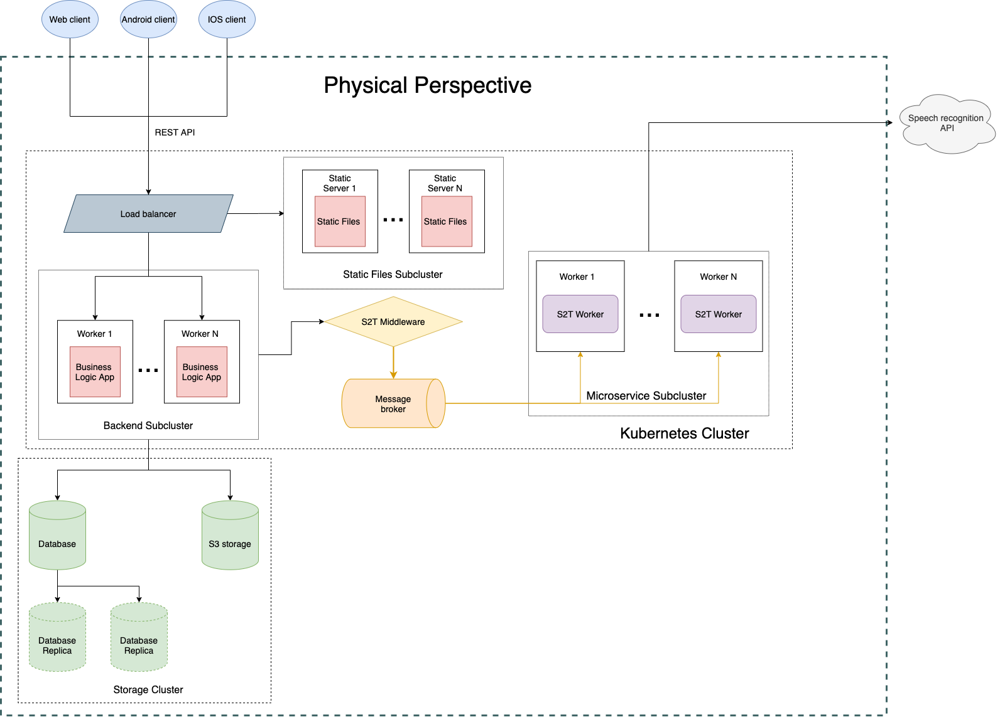

# Speech notes

Our project provides an ability to work with personal notes in text and voice formats. When recording a voice note, it is then translated to text and is available in a convenient form. The application makes it possible to create and manage personal notes securely.

The feature of conversion of a voice note brings many potential benefits related to conventional information medium such as text. This benefits include searching notes by text and sharing the information via classical text-based channels. Also, this approach enables hands-free experience making it more flexible and appropriate for people with special needs.

The product uses an increasingly popular speech recognition technology which is currently is not supported in most similar products. Our project is aimed to fill this gap and provide pleasant and consistent user experience while bringing an ability to keep personal information secure.

### Prerequisites

This project relies on the [Docker](https://www.docker.com/) and the [Docker Compose](https://github.com/docker/compose). You should install them to build and run the project.

The system uses [RabbitMQ](https://www.rabbitmq.com/) and [PostgreSQL](https://www.postgresql.org/) as message broker and RDBMS respectively. Docker containers forwards default ports for them, therefore you should make sure, that these services shutted down or you should map different ports in _docker-compose.yml_ file.

### Build

To build the project and fetch all dependencies you need to create own _docker-compose.yml_ based on _docker-compose.dev.yml_ or just simply make a soft link:

``` sh
ln -s docker-compose.dev.yml docker-compose.yml
```


And then run the build command:

``` sh
docker-compose build
```

### Run

To run the project simply execute the following command:

``` sh
docker-compose up
```

### Views from different perspectives
##### Static

##### Dynamic

##### Physical


### File Structure

Here you can see simplified file structure of a project:

```
.                                                             
├── backend
├── docker-compose.dev.yml
├── docs
├── frontend
└── speech2text
    ├── middleware
    └── worker
```

* __backend__ folder contains code for the main backend service.
* __docker-compose.dev.yml__ file is a example of docker compose configuration file.
* __docs__ folder contains assets for documentation.
* __frontend__ folder contains code for the web client.
* __speech2text__ folder contains _middleware_ and _worker_ for speech recognition.
